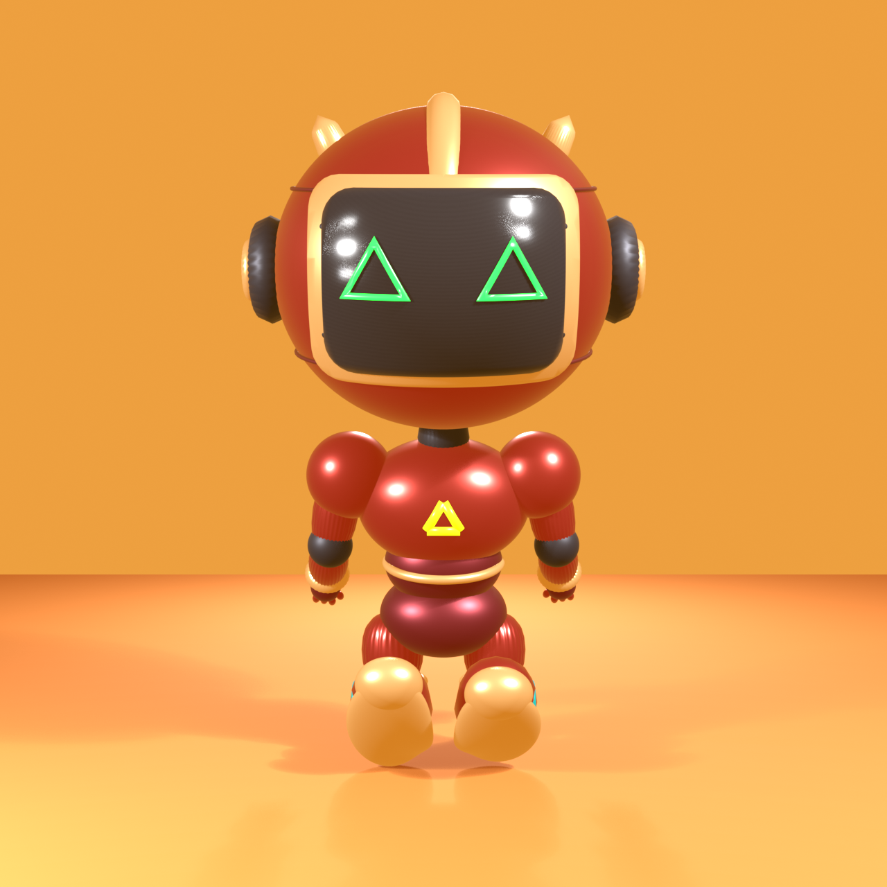
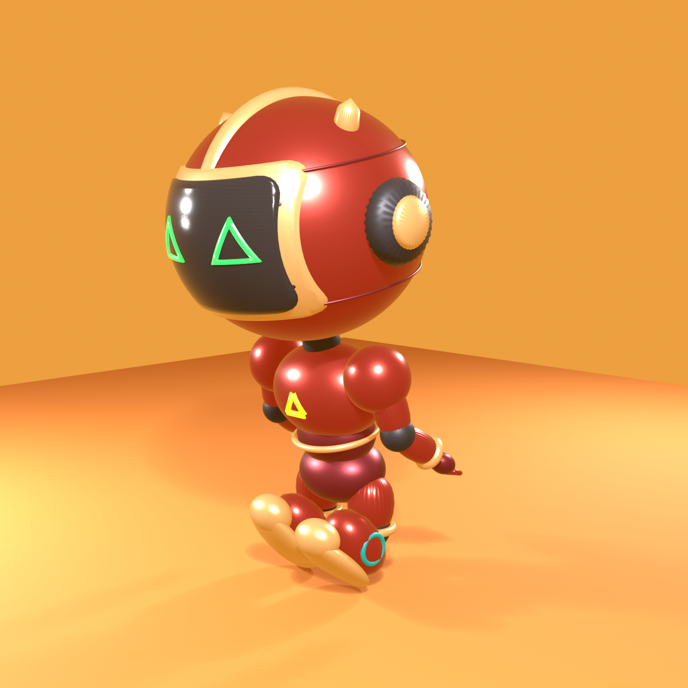
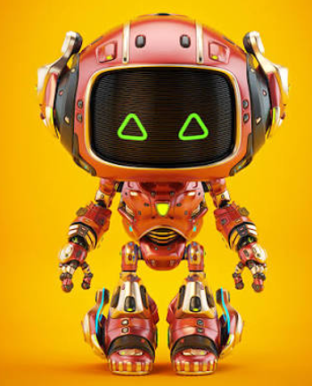
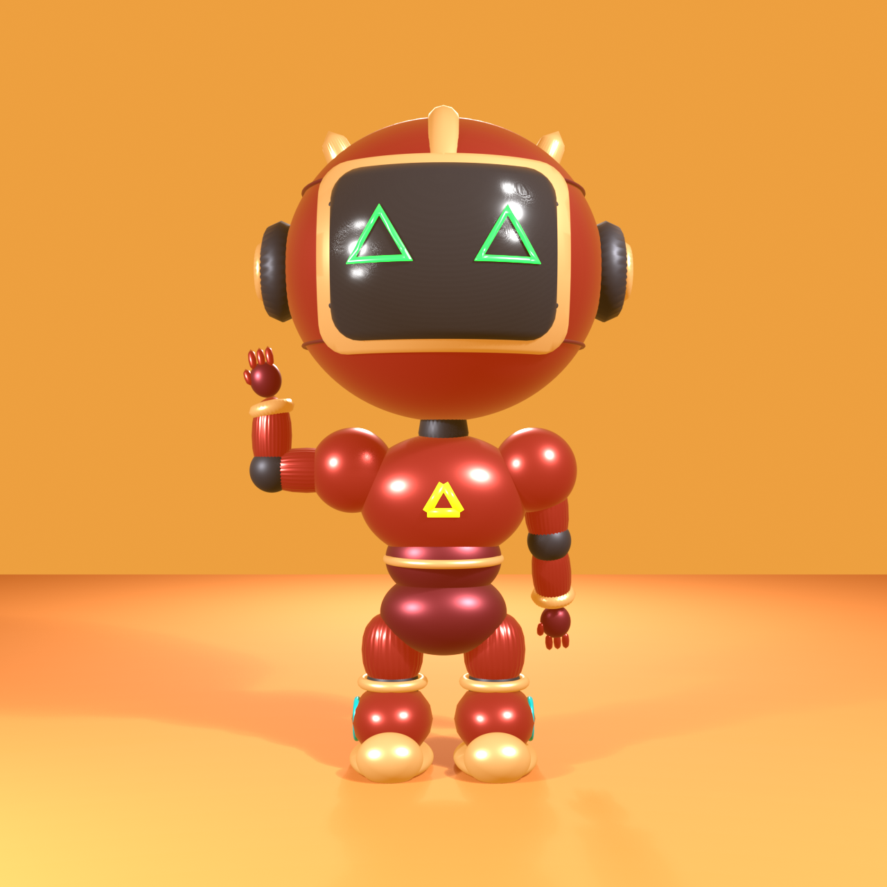
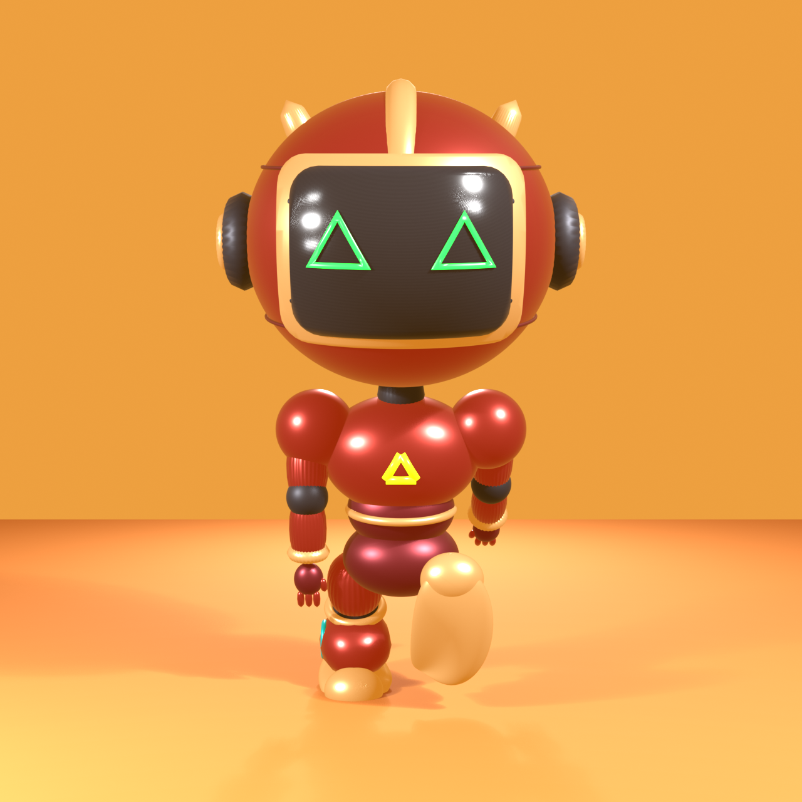
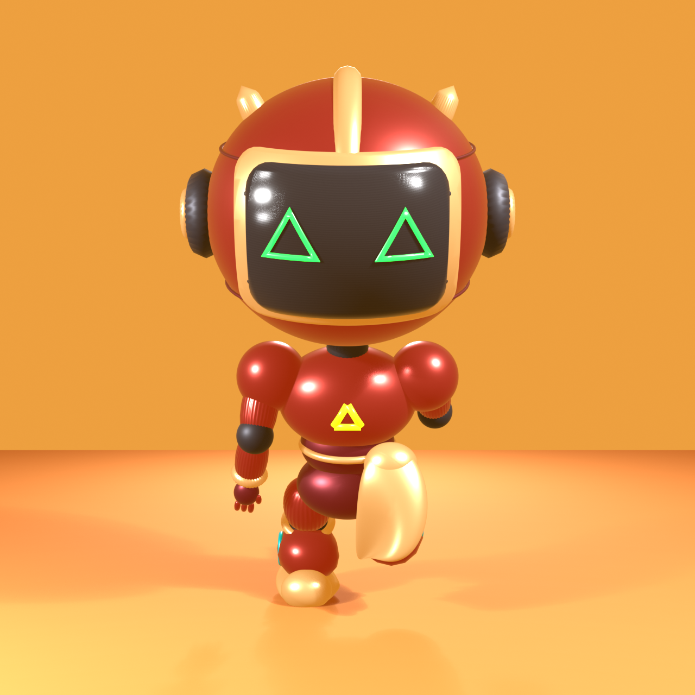

🔗 **项目已开源：** [github.com/derekhu0002/aBot](https://github.com/derekhu0002/aBot) —— 全部代码、Blender 模型、文档、AI 角色定义与可执行验收测试都在这里。欢迎 **Star ⭐ / Fork / Issue**，一起把它从数字孪生推进到一台真实的人形机器人。

---

## 一、我们想做什么

说白了：做一台人形机器人。

现阶段没急着焊电路板，先用 Blender 搭了一个数字孪生——在屏幕上就能看到一台真实比例的 chibi 人形机器人，能站、能走、能挥手。在这个基础上，再往上叠运动控制、感知、LLM 智能这些"软件层"。

另外一层私心：这是个亲子共学项目。我家孩子 8 岁，aBot 是他的学习对象，也是我们一起折腾的玩具。

最终路线很清楚：**数字孪生 → MCP 接口 → 真实物理机器人**。

---

## 二、怎么做的

核心思路一句话：**单一事实源 + 契约不变、后端扩三**。

用程序化脚本 `build_humanoid.py` 生成机器人模型，`twin-control` 提供统一动作契约（pose / motion / FK / state），后端可以切换成 Blender 渲染、MuJoCo 物理引擎、或者真机硬件——上层代码一行不用改。

AI（LLM）只允许调用已经验收通过的动作契约白名单，禁止直接输出关节角度。安全联锁先行，不能让孩子玩的机器人突然抽风。

三个层次：

- **数字孪生**：Blender 程序化建模，chibi 人形，19 根骨骼、9 个动作，键盘实时控制
- **MCP 接口**：把 twin-control 封装成 MCP Server，Agent 通过 MCP 控制角色
- **真实 ROBOT**：组装真机 + MCP 接口，Agent 运行在电脑上控制硬件（hardware_adapter 后端）

---

## 三、路线图

| 阶段 | 内容 |
|------|------|
| **P0 数字孪生** | 程序化建模 humanoid.blend（chibi 人形） |
| **P1 实时操控** | twin_server + TwinClient，pose/motion/FK/state 全链路 |
| **P2 物理与运动** | MuJoCo 物理内核（已选型 Adopt），sim2real 桥梁 |
| **P3 感知** | 相机 + IMU 上身，RDK X5 试点 |
| **P4 智能大脑** | LLM 自然语言 → 动作契约白名单 → 安全联锁 → 执行 |
| **P5 硬件对齐** | 组装真实桌面人形机器人（SG90→STS3215/Dynamixel、PCA9685、PC 外挂主控） |

---

## 四、一步一步走到现在

不是一口气规划完再动手的，是走一步看一步、遇到问题解决问题：

**P0 建模** — 程序化生成 chibi 人形 humanoid.blend（`e3f92b0`）

**P1 操控** — 本地控制服务 + 客户端，Agent 实时操控（`c5615ee`）

**参考图改造** — 拿一张参考目标图，把占位人形 restyle 成 chibi 机器人（`b5c099f` / `b752b0c` / `2a02f06`）

**两轮视觉差距修复** — 手部、底座、面罩、硬表面细节（`1a259d0` / `9ae0e65`），视觉分析员复核 9/9 达标

**蒙皮修复** — bone-heat 漏权，改成刚性按部件绑定，抬臂不再拉伸躯干（`3477a39`）

**9 个关键动作** — relax / tpose / apose / idle / wave / walk / nod / look / run，烘焙为骨骼关键帧，GUI 即播（`2a5a1d` / `646ede1` / `c3daae7`）

**键盘控制** — `keyboard_control.py`，键盘实时控制基本动作（`71fb109`）

**MCP 接口** — `twin_mcp_server.py` 封装 twin-control 为 MCP（`990004`）

**aBot 人格** — abot Agent，数字孪生就是它的身体，可以直接对话（`7c9e75`）

---

## 五、我们怎么用 AI 辅助开发

整个项目由多个 AI 角色协作完成。每个角色是一个 opencode Agent，有独立身份、模型与记忆，通过意图图（ArchGraph）共享长期记忆，遵循"验收测试优先"与"KG 优先"的工作流。

人类伙伴（我和孩子）做决策，AI 团队做执行与验证。

| 角色 | 模型 | 职责 |
|------|------|------|
| **项目总管** | qwen3.8-max | 全局目标、长期记忆、角色协调、验收把关 |
| **视觉分析员** | qwen3.8-max（多模态） | 看图/视频/PDF，核对渲染图、复核动作是否达标 |
| **机器人/建模员** | qwen3.8-max（多模态） | Blender/bpy 建模、蒙皮、动作、键盘控制 |
| **MCP 实现** | — | twin-control 封装为 MCP Server |
| **技术洞察团队（5 角色）** | max/flash/deepseek | 雷达侦察→四环评估→实验验证→报告，为选型提供依据 |

几个关键实践：

- **意图图记忆**：所有决策、进展、教训登记进 ArchGraph，AI 跨会话不遗忘
- **验收测试优先**：每个改动先有可执行验收用例（GIVEN-WHEN-THEN），16 个用例全绿才交付
- **委派与复核闭环**：建模员改模型 → 视觉分析员看图复核 → 不达标再修（比如两轮视觉差距修复就是这么干的）
- **联网调研**：用 DashScope WebSearch 做业界选型（物理引擎、桌面机器人方案）
- **AI 即产品**：aBot 人格 Agent 让 AI 拥有"身体"，用户直接对话控制机器人

---

## 六、当前状态与下一步

**当前**：数字孪生可键盘 / MCP / Agent 控制，9 个动作可播放，aBot 人格可对话。阶段①②完成。

**下一步**：阶段③真实物理机器人（同契约换 hardware_adapter 后端），以及 P2 MuJoCo 物理落地。

---

*aBot 项目 · 2026-09-01 · 由 AI 团队（项目总管 / 视觉分析员 / 建模员 / 技术洞察）协作整理*
