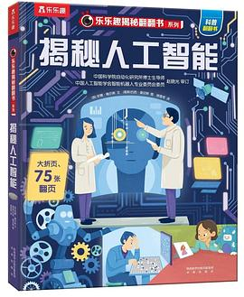
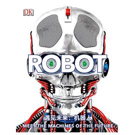
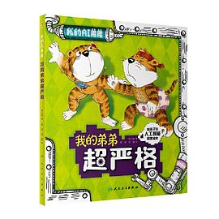
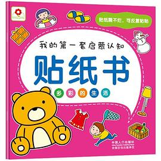

机器人正在走进每一个家庭和课堂，人工智能也已经成为孩子未来无法回避的能力。与其等到「来不及」，不如在好奇心最强的时候，用**绘本、漫画、图鉴**把这些听起来很高深的科技讲给孩子听。**读 + 玩结合**效果最好：读完一本书，再带孩子观察身边的机器人、扫地机，或动手搭个简单的小实验，把书上的「大脑」和「会动的机器」连起来。

这份书单按两条主线整理——**「机器人方向」**先认识会动的机器，**「AI 大脑方向」**再理解让机器变聪明的秘密。每本都标注了适龄与推荐理由，方便家长按孩子的兴趣挑选。

---

## 🚀 机器人方向：先认识「会动的机器」

*机器人是怎么站起来的？关节、传感器又是怎么配合的？*

### 1.《揭秘人工智能》

**乐乐趣·揭秘系列 翻翻书**
适龄：6-8 岁

翻页机关书，图解人工智能与机器人，低龄友好。

> **推荐理由：** 翻页机关书把抽象的「AI」变成「掀开看看」的互动游戏，最适合孩子第一次建立「机器也有大脑」的直观印象，亲子互动性极强。

<a href="https://u.jd.com/kaozLqd" style="color:#9ca3af;font-size:12px;">去购买 ↗</a>

---

### 2.《DK遇见未来：机器人》

**DK 百科图鉴**
适龄：6-12 岁

硬壳大图鉴：机器人种类、关节、传感器、怎么动，图多字少。

> **推荐理由：** DK 以图为主、字少，孩子能对照身边的机器人/玩具看「关节、传感器怎么动」，把书上的构造和实物一一对应，学得最直观。

<a href="https://u.jd.com/k6oqofZ" style="color:#9ca3af;font-size:12px;">去购买 ↗</a>

---

### 3.《人工智能：前沿机器人系列》全 6 册

**山东科学技术出版社**
适龄：7+ 岁

机器人科普百科，覆盖类型、结构与原理。

> **推荐理由：** 体系化覆盖机器人类型与内部原理，适合孩子从「喜欢机器人」走向「想知道机器人为什么这样动」，作为进阶书架很扎实。

购买链接待补充

---

## 🧠 AI「大脑」方向：让机器变聪明的秘密

*从会动到会想——人工智能到底是怎么一回事？*

### 4.《我的 AI 弟弟》

**刘慈欣推荐 · AI 启蒙绘本**
适龄：4-8 岁

用 12 个「二孩」故事讲人工智能知识与情感，孩子容易代入。

> **推荐理由：** 把 AI 讲成和弟弟相处的家庭故事，情感与认知并重，孩子天然代入角色，是亲子共读 AI 概念的绝佳开场。

购买链接待补充

---

### 5.《我的弟弟超严格》

**AI 启蒙绘本 · 北大教授审读**
适龄：5-8 岁

趣味故事讲 AI 的「计算能力」，启发孩子对前沿科学的兴趣。

> **推荐理由：** 用生活化故事讲清 AI 的「计算能力」，并由北京大学智能学院教授审读把关，帮孩子把「机器人怎么变聪明」理解得既准确又不枯燥。

<a href="https://u.jd.com/k1orOf6" style="color:#9ca3af;font-size:12px;">领优惠券 ↗</a> &nbsp; <a href="https://u.jd.com/kDopzgm" style="color:#9ca3af;font-size:12px;">去购买 ↗</a>

---

### 6.《科技少年日记·人工智能（计算思维篇）》全 10 册

**人民日报出版社**
适龄：7-12 岁

「一看就懂」的 AI 入门漫画，计算思维主线。

> **推荐理由：** 人民日报社出品、漫画风格，主线是「计算思维」——这正是机器人和智能系统做决策的底层逻辑，能把孩子对科技的兴趣稳稳向前引一步。

<a href="https://u.jd.com/kro894b" style="color:#9ca3af;font-size:12px;">去购买 ↗</a>

---

### 7.《我的第一本 AI 入门书：给孩子讲人工智能》

**漫画版**
适龄：7-14 岁

零基础漫画，覆盖 AI 基础认知（识别/语音/生成式 AI 等）。

> **推荐理由：** 覆盖面广，识别、语音、生成式 AI 都有，孩子遇到具体问题（比如机器人认路、听话）时随手可查、可翻，工具书属性强。

<a href="https://u.jd.com/k1oGxie" style="color:#9ca3af;font-size:12px;">去购买 ↗</a>

---

### 8.《我的第一套计算机启蒙书·机器人与人工智能》

**南希·迪克曼 著**
适龄：7-10 岁

一套 4 册之一，专讲「机器人与人工智能」，计算、程序、网络、AI 四大主题。

> **推荐理由：** 从计算机、程序讲到机器人与 AI，恰好把「机器人 + 大脑」这两半拆开讲透，系统性最强，适合作为整套共学的主线书目。

<a href="https://u.jd.com/k1ovoJB" style="color:#9ca3af;font-size:12px;">领优惠券 ↗</a> &nbsp; <a href="https://u.jd.com/kGoaP9T" style="color:#9ca3af;font-size:12px;">去购买 ↗</a>

---

## 给家长的建议

- 低龄孩子优先选**绘本/翻翻书**，从兴趣出发，亲子共读、边读边讨论。
- 想动手的孩子可以搭配**搭建类玩具或 Scratch 图形化编程**，让「动起来」变成自己的作品。
- 书不必一次买齐：按孩子的兴趣点挑 2–3 本起步，兴趣维持住最重要。
- AI 话题注意引导正确认知：AI 是工具与伙伴，不是万能魔法，一起聊聊「它能做什么、不能做什么」。

---

**愿每个孩子，都能在兴趣里遇见未来科技 🚀**

喜欢哪一本，点下方链接带走，和孩子一起开启机器人与 AI 的探索之旅吧！

机器人与人工智能启蒙 · 亲子共读精选书单

